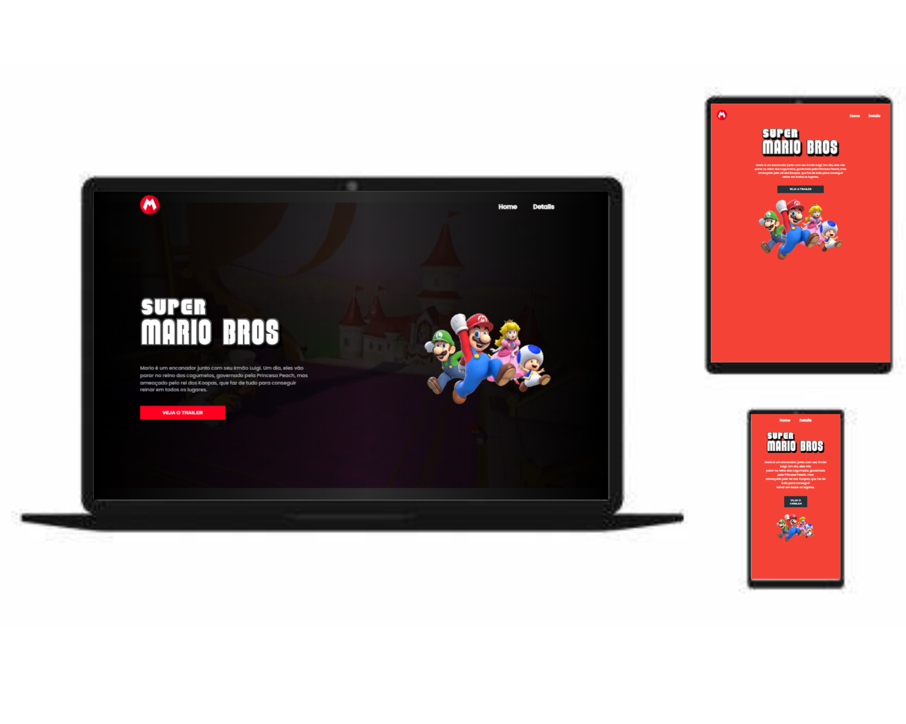

# Super Mario

## Descrição

Este projeto consiste em uma página web responsiva com o tema do Super Mario. A página foi desenvolvida utilizando as seguintes tecnologias: JavaScript, HTML e CSS. Ao clicar no botão "Assistir Trailer", um vídeo do YouTube será reproduzido.

## Tecnologias Utilizadas

- HTML
- CSS
- JavaScript

## Como Executar

1. Clone o repositório para o seu computador.
2. Abra o arquivo `index.html` em um navegador web.

## Funcionalidades

- Página web responsiva com o tema do Super Mario.
- Botão "Assistir Trailer" que reproduz um vídeo do YouTube.

## Contribuindo

Se você deseja contribuir com este projeto, por favor, faça um fork do repositório e envie um pull request com suas alterações.
